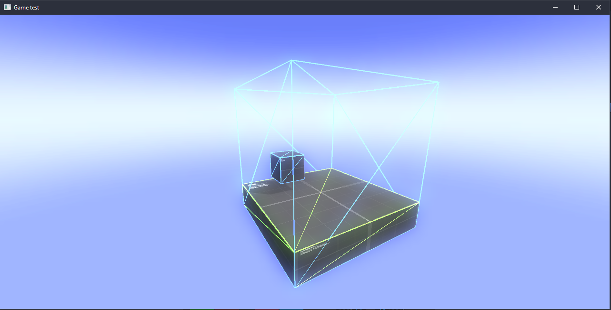

# This version game engine is deprecated!
In the process of writing a new stable version, with a gui interface and much more...


# ParadoxEngine
 The lightweight java 3D game engine!

### Getting Started

1. Download the last release engine.
2. Connect .jar file as a library in your project.
3. Soon...

### Example 


```java
public class GameTest {

    public GameTest() throws Exception {
        Scene mainScene = new Scene("MAIN_SCENE"); // Creating a main scene
        Camera mainCamera = new Camera(); // Creating a new free-camera

        Light sun = new Light("SUN",
                new Vector3f(100000, 150000, 100000), new Vector3f(1.3f, 1.3f, 1.3f)); // The main source of light

        GameObject box = new GameObject("BOX", Shapes.getCubeModel(),
                //  \/  AABB COLLISION  BOX \/
                new Vector3f(0), new Vector3f(1)) { // Creating a new game object
            @Override
            public void update(float delta) {
            }
        }.setScale(1f).setPosition(new Vector3f(1, 1.5f, 1)); // Set scale & position

        GameObject box2 = new GameObject("BOX2", Shapes.getCubeModel(),
                //  \/  AABB COLLISION  BOX \/
                new Vector3f(0), new Vector3f(5)) { // Creating a new game object
            @Override
            public void update(float delta) {
            }
        }.setScale(new Vector3f(5, 1, 5)).setPosition(new Vector3f(0, 0, 0)); // Set scale & position

        mainScene
                .setCurrentCamera(mainCamera) // Set current camera
                .addGameObject(box) // Add new game object
                .addGameObject(box2) // Add new game object
                .addLight(sun); // Add new light
    }

    public static void main(String[] args) throws LWJGLException, Exception {
        MultiGL.initialize(MultiGL.FrameBufferObjectMode.OPENGL); // Set OpenGL fbo mode
        Window.create("Game test", 1280, 620); // Create a window
        {
            GameTest test = new GameTest();
            Window.runGameLoop(); // Run game loop
        }
        Window.destroyWindow(); // Destroy a window when close game
    }
}
```


#### Used libraries
- LWJGL 3.2.1 [https://www.lwjgl.org/]
- Zip4j [https://github.com/srikanth-lingala/zip4j]
- Apache commons-io-1.3.2


My english is bad :(
